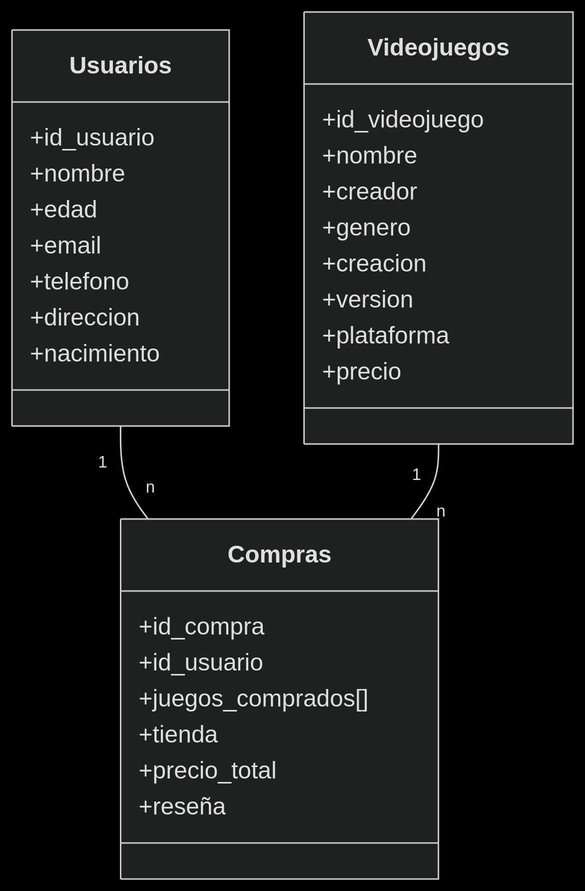

# 🎮 Proyecto de Gestión de Compras de Videojuegos

Este proyecto simula un sistema de compras de videojuegos, incluyendo registros de usuarios, catálogo de juegos y transacciones de compra. Los datos están estructurados en formato JSON para facilitar su integración con aplicaciones web o móviles.

## 📂 Estructura del Proyecto
```
videojuegos-db/
│
├── 📄 usuarios.json # Registros de 20 clientes
├── 📄 videojuegos.json # Catálogo de 30 videojuegos
├── 📄 compras.json # 25 transacciones de compra
└── 📄 README.md # Este archivo
```

## 🧩 Estructuras de Datos

### 1. Usuarios (`usuarios.json`)
```json
{
    "id_usuario": "1",
    "nombre": "Juan Carlos Montoya",
    "edad": "25",
    "email": "juancmonto@gmail.com",
    "telefono": "3152048997",
    "direccion": "Calle 20 #5-6",
    "nacimiento": "02/10/2001"
}
```

### 2. Videojuegos (`videojuegos.json`)
```json
{
    "id_videojuego": "1",
    "nombre": "Call of Duty: Modern Warfare",
    "creador": "Infinity Ward",
    "genero": "FPS",
    "creacion": "25/10/2019",
    "version": "1.35",
    "plataforma": "Xbox One",
    "precio": "59.99"
}
```

### 3. Compras (`compras.json`)
```json
{
    "id_compra": "1",
    "id_usuario": "1",
    "juegos_comprados": [
        {
            "id_videojuego": "3",
            "nombre": "Red Dead Redemption 2",
            "precio": 39.99,
            "cantidad": 1
        }
    ],
    "tienda": "Xbox Store",
    "precio_total": 39.99,
    "reseña": "Impresionantes gráficos"
}
```
# 🔗 Relaciones entre Datos




#  🛠️ Configuración del Proyecto
```
git clone [https://github.com/JuanGualdronGallo1203/Taller_Videojuegos]
cd videojuegos-db
npm install  # Para dependencias JavaScript
```

# 📝 Licencia
```
MIT License
Copyright (c) 2023 [Juan Sebastian Gualdron]

Permiso otorgado para uso comercial y modificaciones, con atribución requerida.
```